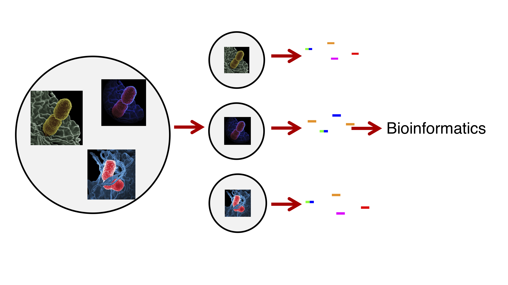
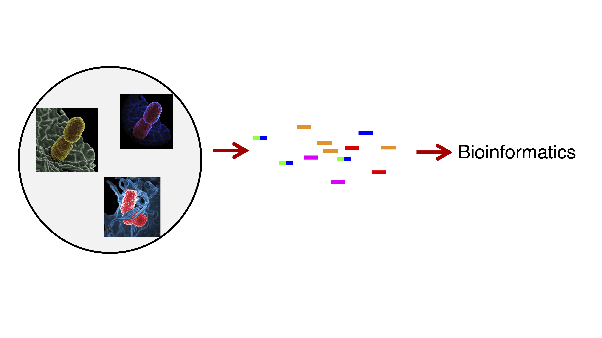
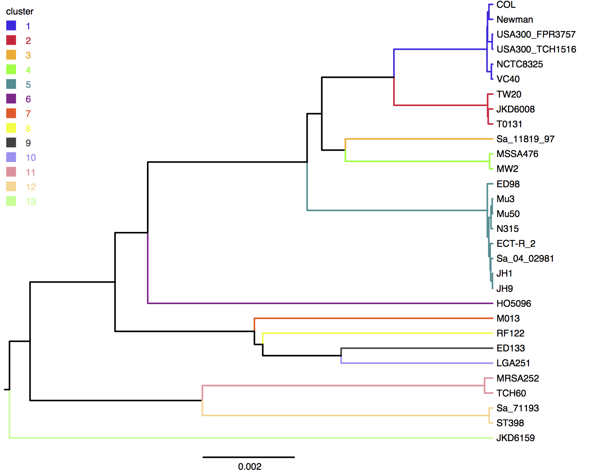
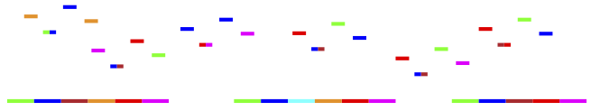
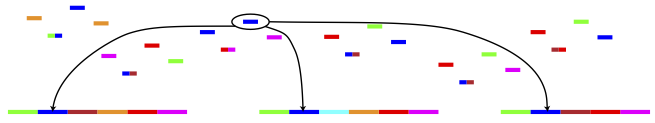
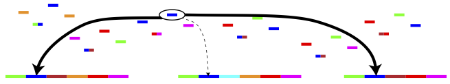
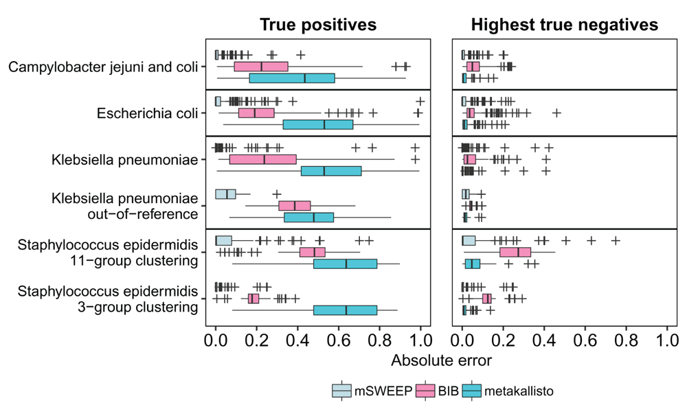
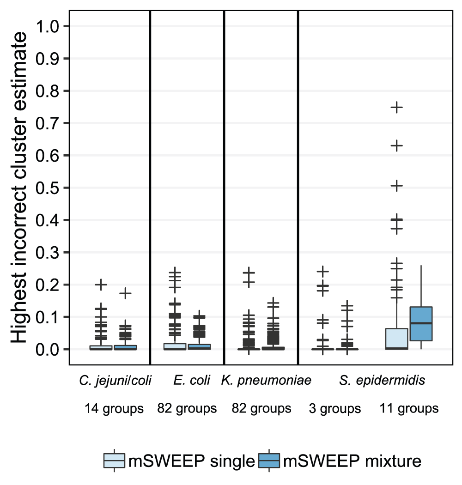
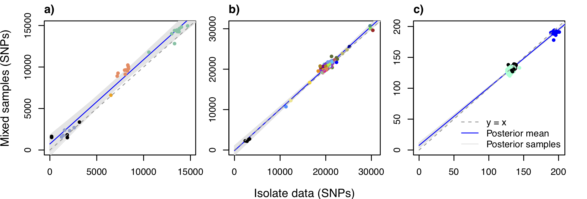
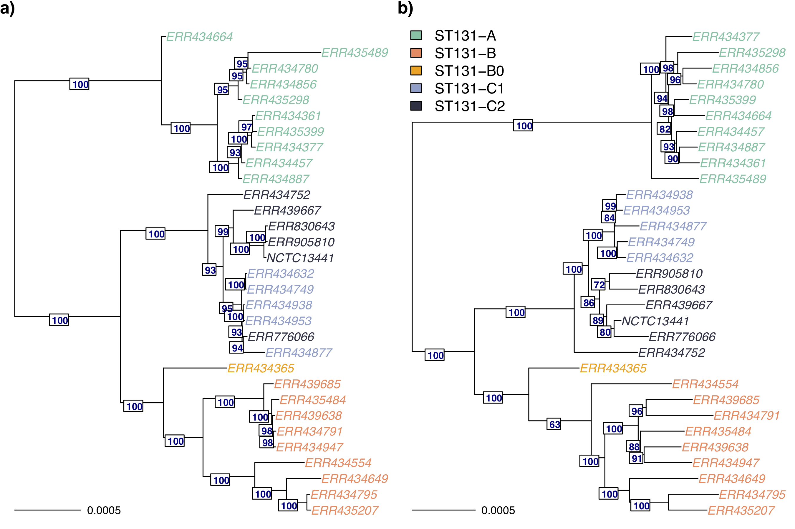

<!-- ItAB20-mSWEEP slides (c) by Tommi Mäklin (tommi@maklin.fi) -->

<!-- This work is licensed under the Creative Commons Attribution 4.0 -->
<!-- International License. To view a copy of this license, visit -->
<!-- http://creativecommons.org/licenses/by/4.0/ or send a letter to -->
<!-- Creative Commons, PO Box 1866, Mountain View, CA 94042, USA. -->

---
title: 'Bacterial strain identification from sequencing data'
author: "Tommi Mäklin"
date: "22 April 2020"
output: ioslides_presentation
---

```{r setup, include=FALSE}
knitr::opts_chunk$set(echo = FALSE)
library(knitr)
```

## Availability

Slides as R Markdown document

- https://version.helsinki.fi/temaklin/itab20-msweep

mSWEEP code

- https://github.com/PROBIC/mSWEEP

Slides available under CC-BY 4.0 license, code under MIT license.

## Motivation: strain identification

- Bacterial infections remain a major killer around the world.
	- 33 000 excess deaths attributable to antibiotic resistance in the EU in 2015 [Cassini et al. 2019, Lancet Infect Dis](https://www.thelancet.com/journals/laninf/article/PIIS1473-3099(18)30605-4/fulltext) 
- Resistance emerging in many common pathogens
	- *Mycobacterium tuberculosis* (cause of tuberculosis)
	- [WHO Global priority list of antibiotic-resistant bacteria](https://www.who.int/medicines/publications/global-priority-list-antibiotic-resistant-bacteria/en/)

## Motivation: strain identification

- Bacterial infections remain a major killer around the world.
	- 33 000 excess deaths attributable to antibiotic resistance in the EU in 2015 [Cassini et al. 2019, Lancet Infect Dis](https://www.thelancet.com/journals/laninf/article/PIIS1473-3099(18)30605-4/fulltext) 
- Resistance emerging in many common pathogens
	- *Mycobacterium tuberculosis* (cause of tuberculosis)
	- [WHO Global priority list of antibiotic-resistant bacteria](https://www.who.int/medicines/publications/global-priority-list-antibiotic-resistant-bacteria/en/)

- Whole-genome sequencing
	- Precision diagnostics
	- Epidemiological studies
    - $< 20$ € per genome
- ... but isolating strains for sequencing is expensive.


## One solution: plate sweep sequencing

- Sequence all strains on a culture plate at once.
	- Less laboratory work: skip the isolation step.
	- Sequence everything at once.
	- More representative of the variation in the original sample.

## Traditional data collection

```{r out.width='100%'}

```

Culture -> Isolate -> Culture -> Sequence -> Analyse

## Plate sweep sequencing

```{r out.width='100%'}

```

Culture -> Sequence -> Analyse

## One solution: plate sweep sequencing

- Sequence all strains on a culture plate at once.
	- Less laboratory work: skip the isolation step.
	- Sequence everything at once.
	- More representative of the variation in the original sample.

- Challenges
	- Strains are difficult to distinguish in mixed data.
	- Pipelines are designed for isolate sequencing data.
	- Unconventional: not (yet?) widely done.


## Example: *Staphylococcus aureus*
```{r out.width='85%', fig.align="center"}

```

## The strain identification problem

Assume: known clusters $c$ of bacterial strains and their reference sequences

Task: given sequencing reads $r_n$, identify the underlying mixture
of clusters and their proportions $\theta$

```{r out.width='100%'}

```

Single reads may be ambiguous and belong to multiple strains.

## The strain identification problem

Assume: known clusters $c$ of bacterial strains and their reference sequences

Task: given sequencing reads $r_n$, identify the underlying mixture
of clusters and their proportions $\theta$

```{r out.width='100%'}

```

Single reads may be ambiguous and belong to multiple strains.


## The strain identification problem

Assume: known clusters $c$ of bacterial strains and their reference sequences

Task: given sequencing reads $r_n$, identify the underlying mixture
of clusters and their proportions $\theta$

```{r out.width='100%'}

```

Single reads may be ambiguous and belong to multiple strains.


## mSWEEP pipeline ([Mäklin *et al.* 2020](https://wellcomeopenresearch.org/articles/5-14/v1))

Pre-processing (one time operation):

1. Obtain reference genomes (e.g. from [ENA](https://www.ebi.ac.uk/ena) or [NCBI](https://www.ncbi.nlm.nih.gov/))
2. Cluster the reference genomes
	- Multilocus sequence types with the [mlst
      software](https://github.com/tseemann/mlst)
	- Or more general clusters using [PopPUNK](https://github.com/johnlees/PopPUNK)
3. Prepare an index of the reference genomes.

Analysis (once for each sample):

1. Pseudoalign the reads ([Themisto](https://github.com/algbio/themisto))
2. Estimate the mixing proportions ([mSWEEP](https://github.com/PROBIC/mSWEEP))

## Example: *Staphylococcus aureus*

```{r out.width='85%',fig.align="center"}

```


## Experiment: true origin of isolate sequencing data

Setup: isolate sequencing data from multiple species:

- *Campylobacter jejuni* and *Campylobacter coli*
- *Escherichia coli*
- *Klebsiella pneumoniae*
- *Staphylococcus epidermidis*

Can we identify the true sequence type with mSWEEP?

- Let's see...

## Results: true origin of isolate sequencing data

```{r out.width='90%',fig.align="center"}

```

Figure 2 from [Mäklin *et al.* 2020, *Wellcome Open Research*](https://wellcomeopenresearch.org/articles/5-14/v1)).

## Experiment: synthetic mixtures

Setup: synthetically mix the isolate data from the previous slides
together. How well do we identify the true source now?

## Results: synthetic mixtures


```{r out.width='60%',fig.align="center"}

```

Figure 4 from [Mäklin *et al.* 2020, *Wellcome Open Research*](https://wellcomeopenresearch.org/articles/5-14/v1)).


## Analysing clinical sequencing samples

- As a practical example, let us look at some mixed sequencing data
  analyzed in [Sankar *et al.* (*Microbial genomics* 2016)](https://www.microbiologyresearch.org/content/journal/mgen/10.1099/mgen.0.000075)
- We will analyse a small number of clinical sequencing samples of
  *S. aureus* that are suspected of contamination because corresponding
  assemblies are significantly longer than a typical *S. aureus* genome

- To run this yourself, you will first need to install
	- [mlst
      software](https://github.com/tseemann/mlst)
	- [Themisto](https://github.com/algbio/themisto)
	- [mSWEEP](https://github.com/PROBIC/mSWEEP)

## mSWEEP pipeline ([Mäklin *et al.* 2020](https://wellcomeopenresearch.org/articles/5-14/v1))

Pre-processing (one time operation):

1. Obtain reference genomes (e.g. from [ENA](https://www.ebi.ac.uk/ena) or [NCBI](https://www.ncbi.nlm.nih.gov/))
2. Cluster the reference genomes
	- Multilocus sequence types with the [mlst
      software](https://github.com/tseemann/mlst)
	- Or more general clusters using [PopPUNK](https://github.com/johnlees/PopPUNK)
3. Prepare an index of the reference genomes.

Analysis (once for each sample):

1. Pseudoalign the reads ([Themisto](https://github.com/algbio/themisto))
2. Estimate the mixing proportions ([mSWEEP](https://github.com/PROBIC/mSWEEP))


## Index preparation

Download and extract the *S.aureus* and *Staphylococcus epidermidis* sequence
assemblies produced in [Méric *et al.* (*Genome Biology and Evolution* 2015)](https://academic.oup.com/gbe/article/7/5/1313/604163)
```{sh echo = TRUE,eval = FALSE}
wget https://ndownloader.figshare.com/files/22366911 \
     -O staphylococcus_reference.tgz
tar -zxvf staphylococcus_reference.tgz
```

Run [mlst](https://github.com/tseemann/mlst) to identify the clusters (sequence types)
```{sh echo = TRUE,eval = FALSE}
mlst staphylococcus_reference/*.fna > staph_sts.tsv
```

Filter out sequences that can't be assigned to a sequence type
```{sh echo = TRUE,eval = FALSE}
grep -v "[[:blank:]]-[[:blank:]]" staph_sts.tsv > staph_sts_fil.tsv
```

## Index preparation (cont.)

Concatenate the sequences by adding a 240 bp gap
between contigs, and merge the sequences to a single fasta file

```{sh echo = TRUE,eval = FALSE}
gap=$(printf 'N%.0s' {1..240})
while read file; do
    name=${file%.fna}
    name=${name##*/}
    name=">"$name
    echo $name >> reference.fasta
    sed "s/^>.*/$gap/g" $file | tr -d '\n' | fold >> reference.fasta
    echo "" >> reference.fasta
done < <(cut -f1 staph_sts_fil.tsv)
```

Extract the cluster indicators
```{sh echo = TRUE,eval = FALSE}
cut -f2,3 staph_sts_fil.tsv | sed 's/[[:blank:]]/-ST/g' > clusts.txt
```

## Exploring the reference

```{sh echo=TRUE,eval=TRUE}
head reference.fasta
```

## Exploring the reference

```{sh echo=TRUE,eval=TRUE}
grep '>' reference.fasta
```

## Exploring the reference

```{sh echo=TRUE,eval=TRUE}
cat clusts.txt
```

## Building an index
Run the 'build_index' command from [Themisto](https://github.com/algbio/themisto)
```{sh eval=FALSE, echo=TRUE}
mkdir reference_index
mkdir reference_index/tmp
build_index --k 31 --input-file reference.fasta --auto-colors \
	    --index-dir reference_index --temp-dir reference_index/tmp \
	    --mem-megas 4192 --n-threads 2
```

## Downloading sequencing data from ENA

https://www.ebi.ac.uk/ena — the European Nucleotide Archive

Download using your browser from

- https://www.ebi.ac.uk/ena/data/view/ERR033686

...or use the provided script
```{sh echo = TRUE, eval = FALSE}
chmod +x get_reads.sh
./get_reads.sh ERR033686
```

## Running the analysis (one sample)

Run the 'pseudoalign' command from Themisto
```{sh eval=FALSE, echo=TRUE}
pseudoalign --query-file ERR033686_1.fastq.gz --outfile \
	    ERR033686_1.aln --index-dir reference_index \
	    --temp-dir reference_index/tmp --rc \
	    --n-threads 2 --gzip-output --sort-output
pseudoalign --query-file ERR033686_2.fastq.gz --outfile \
	    ERR033686_2.aln --index-dir reference_index \
	    --temp-dir reference_index/tmp --rc \
	    --n-threads 2 --gzip-output --sort-output
```

Use mSWEEP to estimate the abundances of the reference clusters
```{sh eval=FALSE, echo=TRUE}
mSWEEP --themisto-1 ERR033686_1.aln.gz --themisto-2 ERR033686_2.aln.gz \
       --themisto-index reference_index -i clusts.txt -o ERR033686
```

## Looking at the results

``` {sh echo=TRUE}
sed -n '1,3p' ERR033686_abundances.txt
sort -gk2 ERR033686_abundances.txt | grep -v "^[#]" | tail | tail -r
```

## Running the analysis (multiple samples)

```{sh eval=FALSE, echo=TRUE}
SAMPLES="ERR033658 ERR033686 ERR038357 ERR038367 ERR038366"

for sample in $SAMPLES ; do
  ./get_reads.sh $sample
  pseudoalign --query-file $sample""_1.fastq.gz --outfile \
      $sample""_1.aln --index-dir reference_index --temp-dir \
      reference_index/tmp --rc --n-threads 2 --gzip-output --sort-output
  pseudoalign --query-file $sample""_2.fastq.gz --outfile \
      $sample""_2.aln --index-dir reference_index --temp-dir \
      reference_index/tmp --rc --n-threads 2 --gzip-output --sort-output
  mSWEEP --themisto-1 $sample""_1.aln.gz --themisto-2 $sample""_2.aln.gz \
      --themisto-index reference_index -i clusts.txt -o $sample
done
```


## Looking at the results

``` {sh echo=TRUE}
sed -n '1,3p' ERR033658_abundances.txt
sort -gk2 ERR033658_abundances.txt | grep -v "^[#]" | tail | tail -r
```


## Looking at the results

``` {sh echo=TRUE}
sed -n '1,3p' ERR033686_abundances.txt
sort -gk2 ERR033686_abundances.txt | grep -v "^[#]" | tail | tail -r
```


## Looking at the results

``` {sh echo=TRUE}
sed -n '1,3p' ERR038357_abundances.txt
sort -gk2 ERR038357_abundances.txt | grep -v "^[#]" | tail | tail -r
```


## Looking at the results

``` {sh echo=TRUE}
sed -n '1,3p' ERR038367_abundances.txt
sort -gk2 ERR038367_abundances.txt | grep -v "^[#]" | tail | tail -r
```


## Looking at the results

``` {sh echo=TRUE}
sed -n '1,3p' ERR038366_abundances.txt
sort -gk2 ERR038366_abundances.txt | grep -v "^[#]" | tail | tail -r
```

## Analysis

```{r echo=TRUE, eval=TRUE}
tol15rainbow=c("#114477", "#4477AA", "#77AADD", "#117755", "#44AA88",
               "#99CCBB", "#777711", "#AAAA44", "#DDDD77", "#771111",
               "#AA4444", "#DD7777", "#771144", "#AA4477", "#DD77AA")

mycols <- c(tol15rainbow[1:13], "#000000", "#555555", "#AAAAAA")

ids <- c("ERR033658", "ERR033686", "ERR038357", "ERR038366", "ERR038367")
files <- paste(ids, "_abundances.txt", sep="")
clusters <- read.table(files[1], stringsAsFactors=FALSE)[, 1]

abundances <- matrix(0, nrow = length(files), ncol = length(clusters))
rownames(abundances) <- ids
colnames(abundances) <- clusters
for (i in 1:length(files)) {
    abundances[i, ] <- read.table(files[i])[, 2]
}
```

## Analysis (cont.)

```{r echo=FALSE, eval=TRUE}
most.abundant <- tail(order(colSums(abundances)), 15)
strains <- colnames(abundances)[most.abundant]

v <- t(abundances[, most.abundant])

par(mar=c(2, 6, 0, 5), xpd = NA)
barplot(v, col=mycols, horiz=TRUE, legend.text=TRUE, las=1, xlim=c(0, 1),
        args.legend=list(x=1.17))
```

## Further considerations: assembly

Most analyses of interest require either sequence assemblies or
isolate sequencing data.

- SNP calling
- Phylogenetic inference
- Transcript expression estimation
- *et cetera*

We've recently developed a continuation of mSWEEP, called
[mGEMS](https://github.com/PROBIC/mGEMS), which separates the mixed
sequencing data and enables these analyses.

- mGEMS is described in the preprint [Mäklin *et al.* 2020,
     *bioRxiv*](https://www.biorxiv.org/content/10.1101/2020.04.03.021501v1)
     (not yet peer-reviewed).

## Evaluating mGEMS
Experiment setup: synthetic mixtures of *E. coli*, *E. faecium*, and
*S. aureus* strains.

Results of SNP calling from synthetic mixtures vs. isolate sequencing data

```{r out.width='100%'}

```

## Evaluating mGEMS
Experiment: synthetic mixtures of *E. coli*  ST131 strains. Phylogeny from isolates (left) and mixtures (right).

```{r out.width='90%',fig.align="center"}

```


## Try it yourself

A tutorial for using mGEMS to reproduce the *E. coli* phylogenetic
analyses is [on GitHub](https://github.com/PROBIC/mGEMS/blob/master/docs/TUTORIAL.md)

(Extra) Adapt the instructions from the mGEMS tutorial to the
*S. aureus* data we analysed during the lecture.

- Can you apply mGEMS to the data analyzed during the lecture and
assemble the genomes contained in the mixed samples?

## Conclusion

- Fast and accurate identification and quantification of bacterial
  strains from mixed sequencing data.
- Nearly perfect accuracy for species with clonal population
  structures (e.g. *E. coli*, *K. pneumoniae*)
- Assemblies from mixed sequencing data can be obtained using mGEMS,
  with accuracy in downstream analyses resembling the results of using
  isolate sequencing data.

If you try the methods and run into problems, you can reach me at
tommi.maklin@helsinki.fi.

We're also happy to hear any feedback on how to make our methods
easier to use.
