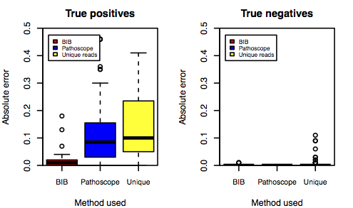
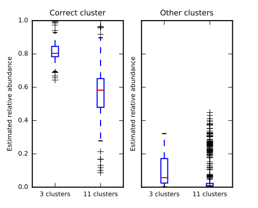
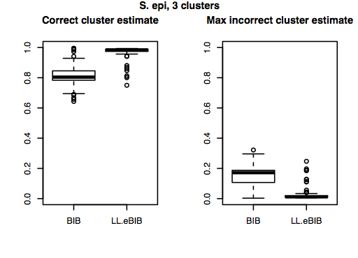
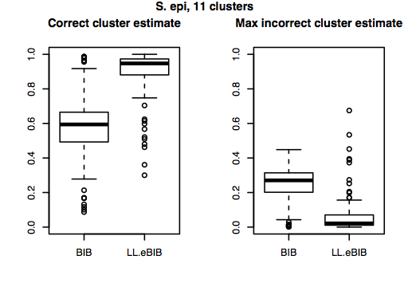

<!-- ItAB20-mSWEEP slides (c) by Tommi Mäklin (tommi@maklin.fi) -->

<!-- This work is licensed under the Creative Commons Attribution 4.0 -->
<!-- International License. To view a copy of this license, visit -->
<!-- http://creativecommons.org/licenses/by/4.0/ or send a letter to -->
<!-- Creative Commons, PO Box 1866, Mountain View, CA 94042, USA. -->

---
title: 'Bacterial strain identification from sequencing data'
author: "Tommi Mäklin and Antti Honkela"
date: "22 April 2020"
output: ioslides_presentation
---

```{r setup, include=FALSE}
knitr::opts_chunk$set(echo = FALSE)
library(knitr)
```

## Availability

Slides as R Markdown document: https://github.com/tmaklin/ItAB18-BIB

BIB code: https://github.com/PROBIC/BIB

Slides available under CC-BY license, code under MIT license


## Motivation: bacterial strain identification

- Bacterial infections remain a major killer around the world, antibiotic resistance increasing risks
- Major cause of e.g. sepsis, which affects 18M people globally and kills 200k people in the US alone
- WGS has potential for precision diagnostics
    - $< 20$ € per genome
- Mixed infections are relatively common, cause challenges for assembly-based pipelines

## Example: Genomics of *Staphylococcus aureus*

```{r out.width='70%'}
include_graphics('figures/Saureus_annotated.png')
```

## The bacterial strain identification problem

Assume: known clusters $c$ of bacterial strains and their reference sequences

Task: given sequencing reads $r_n$, identify the underlying mixture
of clusters and their proportions $\theta$

```{r}
include_graphics('figures/sequencing_reads.pdf')
```

Single reads may be ambiguous, but as a whole they can identify the mixture.


## The bacterial strain identification problem

Assume: known clusters $c$ of bacterial strains and their reference sequences

Task: given sequencing reads $r_n$, identify the underlying mixture
of clusters and their proportions $\theta$

```{r}
include_graphics('figures/sequencing_reads2.pdf')
```

Single reads may be ambiguous, but as a whole they can identify the mixture.


## The bacterial strain identification problem

Assume: known clusters $c$ of bacterial strains and their reference sequences

Task: given sequencing reads $r_n$, identify the underlying mixture
of clusters and their proportions $\theta$

```{r}
include_graphics('figures/sequencing_reads3.pdf')
```

Single reads may be ambiguous, but as a whole they can identify the mixture.


## BIB v1 pipeline (Sankar *et al.*, MGen 2016)

Pre-processing (one time operation):

1. Obtain multiple alignment of the reference genomes (progressiveMauve)
2. Extract core genomes
3. Cluster the genomes (hierBAPS)
4. Prepare an index of selected representatives of each cluster

Analysis (for each sample):

1. Align the reads (Bowtie2)
2. Estimate the mixing proportions (BitSeqVB)


## Example: *Staphylococcus aureus* and *S. epidermidis*

```{r}
include_graphics('figures/trees_highlighted.pdf')
```


## Experimental setup: Synthetic mixtures of staphylococci

- Mix reads from real single colony sequencing runs of *S. aureus* and *S. epidermidis* in known proportions
- Some experiments include *Bacillus* contamination
- Compare against
    - Pathoscope (Francis *et al.*, 2013; Hong *et al.*, 2014)
    - Counting uniquely mapping reads

## Results: Synthetic mixtures of staphylococci

```{r}

```


## Results: *S. epidermidis* cluster identification

```{r}

```


## Analysing clinical sequencing samples

- As a practical example, let us reproduce a result from Sankar *et al.* (*Microbial genomics* 2016)
- We will analyse a small number of clinical sequencing samples of
  *S. aureus* that are suspected of contamination because corresponding
  assemblies are significantly longer than a typical *S. aureus* genome


## BIB v1 pipeline (Sankar *et al.*, MGen 2016)

Pre-processing (one time operation):

1. Obtain multiple alignment of the sequences (progressiveMauve)
2. Extract core genomes
3. Cluster the sequences (hierBAPS)
4. Prepare an index of selected representatives of each cluster

Analysis (for each sample):

1. Align the reads (Bowtie2)
2. Estimate the mixing proportions (BitSeqVB)


## Index preparation

- Extracting the core genomes, clustering and selecting
  representatives is likely the hardest task
- We use a set of *S. aureus* core genomes provided with BIB

## Exploring the core genome reference

```{sh echo=TRUE}
head ~/github/BIB/input/Aureus_core.fasta
```

## Exploring the core genome reference

```{sh echo=TRUE}
grep '>' ~/github/BIB/input/Aureus_core.fasta
```

## Reminder: Phylogeny of *Staphylococcus aureus*

```{r out.width='70%'}
include_graphics('figures/Saureus_annotated.png')
```


## Building an index

```{sh eval=FALSE, echo=TRUE}
python ~/github/BIB/scripts/BIB_prepare_index.py
  ~/github/BIB/input/Aureus_core.fasta aureus_core
```

## Downloading sequencing data from ENA

https://www.ebi.ac.uk/ena

https://www.ebi.ac.uk/ena/data/view/ERR033686

## Running the analysis (one sample)

```{sh eval=FALSE, echo=TRUE}
python ~/github/BIB/scripts/BIB_analyse_reads.py \ 
  "-1 ERR033686_1.fastq.gz -2 ERR033686_2.fastq.gz" \ 
  ~/github/BIB/input/Aureus_core.fasta \ 
  aureus_core results/BIB_ERR033686
```

## Running the analysis (multiple samples)

```{sh eval=FALSE, echo=TRUE}
SAMPLES="ERR033658 ERR033686 ERR038357 ERR038367 ERR038366"

for sample in $SAMPLES ; do
    python ~/github/BIB/scripts/BIB_analyse_reads.py \ 
      "-1 ${sample}_1.fastq.gz -2 ${sample}_2.fastq.gz" \ 
      ~/github/BIB/input/Aureus_core.fasta \ 
      aureus_core results/BIB_${sample}
done
```

## Looking at the results

``` {sh echo=TRUE}
cat results/BIB_ERR033658.m_alphas
```

## Looking at the results

``` {sh echo=TRUE}
python ~/github/BIB/scripts/BIB_parse_output.py results/BIB_ERR033658
```

## Looking at the results

``` {sh echo=TRUE}
python ~/github/BIB/scripts/BIB_parse_output.py results/BIB_ERR033686
```

## Looking at the results

``` {sh echo=TRUE}
python ~/github/BIB/scripts/BIB_parse_output.py results/BIB_ERR038357
```

## Looking at the results

``` {sh echo=TRUE}
python ~/github/BIB/scripts/BIB_parse_output.py results/BIB_ERR038366
```

## Looking at the results

``` {sh echo=TRUE}
python ~/github/BIB/scripts/BIB_parse_output.py results/BIB_ERR038367
```

## Analysis

```{r echo=TRUE, eval=FALSE}
tol15rainbow=c("#114477", "#4477AA", "#77AADD", "#117755", "#44AA88", "#99CCBB", "#777711", "#AAAA44", "#DDDD77", "#771111", "#AA4444", "#DD7777", "#771144", "#AA4477", "#DD77AA")

datadir = "results/"
mycols = c(tol15rainbow[1:13], "#000000", "#555555", "#AAAAAA")

ids <- c("ERR033658", "ERR033686", "ERR038357", "ERR038366", "ERR038367")

files <- paste(datadir, "BIB_", ids, ".m_alphas", sep="")

trs <- read.table(paste(datadir, "BIB_", ids[1], ".tr", sep=""), as.is=TRUE)
clusters = read.table(paste(datadir, "clusters.txt", sep=""), as.is=TRUE, row.names=1)

v = matrix()
for (k in seq_along(files)) {
    al = read.table(files[k])
    v = cbind(v, al["V1"])
}
```

## Analysis

```{r echo=TRUE, eval=FALSE}
strains = trs[,"V2"]

v = t(t(v[2:17,2:6]))
colnames(v) = ids
I = order(clusters[strains,])
row.names(v) = clusters[strains,]
v = v[I,rev(c(3, 5, 1, 2, 4))]

par(mar=c(3, 7, 2, 7))
barplot(v, col=mycols, horiz=TRUE, legend.text=TRUE, las=1, xlim=c(0, 1),
        args.legend=list(x=1.17))
```

## Analysis

```{r echo=FALSE, out.width='100%'}
tol15rainbow=c("#114477", "#4477AA", "#77AADD", "#117755", "#44AA88", "#99CCBB", "#777711", "#AAAA44", "#DDDD77", "#771111", "#AA4444", "#DD7777", "#771144", "#AA4477", "#DD77AA")

datadir = "results/"
mycols = c(tol15rainbow[1:13], "#000000", "#555555", "#AAAAAA")

ids <- c("ERR033658", "ERR033686", "ERR038357", "ERR038366", "ERR038367")

files <- paste(datadir, "BIB_", ids, ".m_alphas", sep="")

trs <- read.table(paste(datadir, "BIB_", ids[1], ".tr", sep=""), as.is=TRUE)
clusters = read.table(paste(datadir, "clusters.txt", sep=""), as.is=TRUE, row.names=1)

v = matrix()
for (k in seq_along(files)) {
    al = read.table(files[k])
    v = cbind(v, al["V1"])
}

strains = trs[,"V2"]

v = t(t(v[2:17,2:6]))
colnames(v) = ids
I = order(clusters[strains,])
row.names(v) = clusters[strains,]
v = v[I,rev(c(3, 5, 1, 2, 4))]

par(mar=c(3, 7, 2, 7))
barplot(v, col=mycols, horiz=TRUE, legend.text=TRUE, las=1, xlim=c(0, 1),
        args.legend=list(x=1.17))
```

## BIB v2 (Mäklin *et al.*, unpublished)

Making BIB significantly faster and even more accurate:

1. Use pseudoalignments instead of full alignments
    - Using RapMap (Patro *et al., 2016)
    - Similar to the approach in Kallisto (Bray *et al., 2016)
  	- Yielding $>20\times$ speedup, typical runtime < 30 s
    - No noticeable impact on accuracy
2. Consider multiple references per cluster
  	- A single reference sequence is not enough to represent more diverse clusters
    - Optimised inference natural for pseudoalignments necessary as BitSeqVB complexity linear in the number of alignments


## BIB v2 *S. epidermidis* results

```{r}

```

## BIB v2 *S. epidermidis* results

```{r}

```

## Conclusion

Application:

- Extremely fast and accurate identification and quantification of bacterial strains
- Nearly perfect accuracy for weakly recombinant species (e.g. *S. aureus*)
- More highly recombinant species challenging for BIB v1, BIB v2 shows great improvement

Methods:

- Using pseudoalignment-based analysis yields significant speedup with insignificant loss in accuracy


